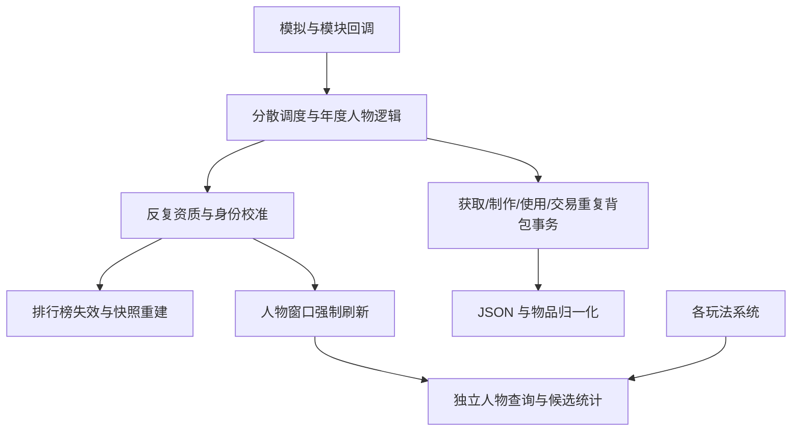
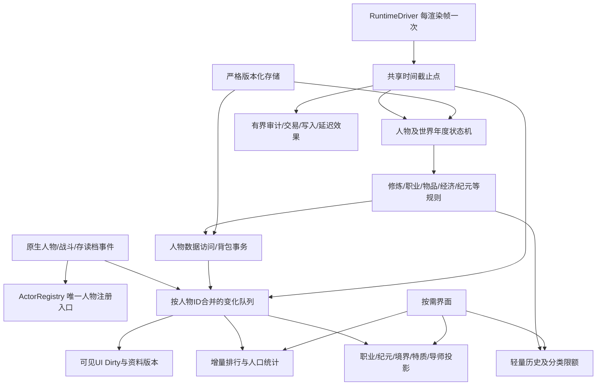

# v0.3.1 架构重构与验收报告

日期：2026-09-30。实施目录：`D:\模拟长胜路\模拟长生路主线`。版本号维持 0.3.1，基线包含开始工作时该目录已有的未提交修改。

**源码重构、自动回归和 Release 构建已完成当前交付轮次；整个任务尚未通过游戏内验收。** 4000～5000 人、20 倍速、30～40 FPS、千年稳定运行以及全部界面的实际显示仍待当前构建实测。本报告不把合成基准或旧版采样当作新构建达标证明。

## 1. 新旧架构对比

| 领域 | 基线的问题 | 当前实现 |
|---|---|---|
| 调度 | 原生模拟、后台刷新与年度车道的预算分散；跨帧等待和 CPU 统计混在一起 | 唯一渲染帧入口、共享 3 ms 后台截止时间、年度状态机、独立完成延迟统计 |
| 人物 | 多入口复制修士快照，系统自行找人物或汇总属性 | 注册表拥有人物引用，稳定 ID 槽位及境界、特质、职业、纪元、身份、城池和资源引用投影 |
| 变化通知 | 数据变化后使整个排行失效，人物唤醒会强制刷新 UI | 合并人物 ID 变化事件、人物资料版本、按受影响人物更新投影和可见界面 |
| 排行 | 定时或开窗重新建表、排序、格式化所有人物 | 有序增量索引；按当前排序读取缓存；筛选查询有界推进；文字在展示时生成 |
| 背包 | 获取、制作、交易多次解析、归一化和写 JSON | 定义、数量栈、实例、效果共用数据模型；事务合并写入；数量和实例索引按版本更新 |
| 法宝 | 未装备复制品也长期保留独立对象；多个系统重复查装备 | 未装备同定义/耐久的成熟数量栈；装备、出售和赠予时提取独立实例；六槽位缓存 |
| UI | 查找所有窗口、全量重画和节点扫描 | 窗口自行登记、Dirty 和资料版本、关闭取消工作；乾坤袋可见区域绘制，原生背包和大列表分页/复用 |
| 历史 | 记录、去重和展示与运行对象混合 | 轻量 ID/名称/年份记录、分类限额、人物历史索引、分页及预算内展示排序 |
| 长线运行 | 完成游标、任务、交易和动态本地化可能积累 | 完成后移除任务，死亡取消 ID 工作；市场过期清理；有限历史、样本和解码缓存；换世界清空运行缓存 |
| 存储 | 旧版本修复、迁移与当前规则同处热路径 | 新命名空间、严格格式版本，移除旧存档迁移；保留当前格式损坏恢复 |

基线扫描和文件依赖见 [source-inventory.md](source-inventory.md) / [source-inventory.json](source-inventory.json)，交付源码扫描见 [refactor-source-inventory.md](refactor-source-inventory.md) / [refactor-source-inventory.json](refactor-source-inventory.json)。这些文件逐项保存路径、行数、散列、声明和依赖候选。依赖来自符号文本分析，不等同于实际运行调用图。

基线 188 个 C# 文件、51452 行；当前 195 个、51685 行。相对开始时的文件散列，93 个发生变化、新增 9 个、删除 2 个，其余 93 个保持一致。保留的文件包括仍然适用的玩法规则、定义、资源注册和功能入口；文件未改动不代表仍保留一套旧调度执行。

旧边界的主要调用关系：

## 2. 删除的废弃系统与代码

完整删除的源码文件：

- `Systems/Runtime/MclslLegacyActorDataRepair.cs`：旧人物数据迁移/修复入口。
- `Systems/WorldResources/MclslWorldArchiveMigration.cs`：旧世界档案迁移。

在保留所属玩法系统的同时删除的实现：

| 所属模块 | 删除内容 | 当前替代 |
|---|---|---|
| 功法占位 | 旧档功法分流迁移状态机、旧候选排序、重复人物引用 | 当前占位索引与生命周期更新 |
| 击杀统计 | 旧修士击杀全量重算/重标定路径 | 原生死亡提交和回滚 |
| 法宝 | 旧原生装备迁移、旧装备原型与重复同步/选择辅助方法 | 统一实例与六槽位状态 |
| 猫宝 | 旧世界摘要结构、摘要迁移 | 独立版本化原生人物快照，保留封存和放置 |
| 新法根基 | 每次校准中的旧奇物迁移 | 当前根基数据；前世遗产恢复继续保留 |
| 年度调度 | 零真元当作未执行而补算、重复年度优先门禁、废弃后台世界门禁、完成游标延迟字典 | 权威完成游标、每渲染帧推进、持久年度状态机 |
| 存储 | 1800 帧定时将全世界档案重复序列化到内存自定义数据 | 实际原生保存和明确的按需保存边界 |
| 模块 | 空档案维护模块及注册 | 领域数据变更和存档入口 |
| 物品目录 | 历史版本 ID 别名表和已移除物品兼容分支 | 当前规范 ID、当前中文显示名及原生资源路径规范化 |
| 材料发现 | 遗府记录上重复的旧奖励去重字段及查询包装 | 有限全局奖励键与唯一来源键 |
| 查询/格式化 | 未引用的年度候选转发、旧排序文本解析、旧列传评分与格式化方法、重复法宝选择、废弃材料需求包装 | 对应当前索引和统一查询 |

删除依据包括生产入口、补丁、模块注册、脚本和测试引用核对。`Legacy` 在部分保留代码中代表“前世遗产”或“旧法玩法”，并非旧存档兼容；这些玩法未因名称命中而删除。当前格式的主数据/备份恢复、游戏状态不变量校验和原生特质 ID 规范化也继续保留。

## 3. 新底层架构

核心代码分别为 `Core/MclslRuntimeDriver.cs`、`MclslRuntimeCollections.cs`、`MclslRuntimeChanges.cs`、`MclslOrderedIdIndex.cs`、`MclslTimedPulseQueue.cs`、`MclslBudgetedView.cs`，以及 `Systems/Runtime` 下注册表、投影、候选索引、选择器和年度调度。全项目只有当前调度入口执行这些玩法，没有保留一套旧调度在旁边重复运行。

人物数量增长主要扩大索引和未完成人物工作。不会在每帧对每个人执行全部玩法。真正实时的战斗沿原生事件调用；脱战施法等使用有界游标；候选审计每 120 帧检查最多 64 人并服从共享截止时间。年度候选分批入队，不重新复制全人口快照。大型择人查询通过分帧 Top-K 推进。

注册表保存原生 `Actor` 引用，投影和排队任务主要保存 ID、评分及必要结构值。UI 绑定和人物派生缓存使用弱表；猫宝封存是明确有上限的完整快照功能，不属于轻量历史。

存储边界：世界根键 `mclsl.architecture.v1`，人物键 `mclsl.architecture.v1.actor.*`；世界档案版本 22、背包版本 4、前世档案版本 3、还真外部状态版本 6。外部文件位于 `MySimulatedLongevityRoad/ArchitectureV1/`。旧根键和旧外部文件不迁移，也不覆盖。实际加载应使用新世界；版本号仍是用户指定的 0.3.1。

## 4. 各模块迁移及玩法保留

下面的“保留”指玩法入口、规则和相关数据在源码中仍然存在；自动测试覆盖范围列于第 9 节，尚未逐项完成实机验收。

| 模块 | 保留的玩法 | 迁移情况 |
|---|---|---|
| 入道/灵根 | 童年灵根、仙缘、资质、心境、感气、手动特质赋予 | 统一人物资料事件；灵根属性与显示缓存，未变化的特质校准提前返回 |
| 旧法/新法修炼 | 真元、进度、大小境界、寿限、转修、突破条件、根基奇物、太上 | 同一年度流水线按人物身份选择规则；无旧版本零真元补算 |
| 功法/传承/法争 | 功法选择、占位、同法冲突、残篇与境界上限 | 当前增量索引；移除旧档分流；保留残缺传承与换法上限规则 |
| 仙师 | 师徒、同城/同国优先、凡人及低境弟子、赠物/授方 | 城池/国家有序候选；凡人后备也使用专用索引，不再扫描 256 人后备名单 |
| 职业 | 职业判定、品阶、经验、配方知识、选方及制作 | 人物投影、配方候选缓存、分阶段制作、统一背包事务 |
| 丹药/符箓/材料/法宝 | 发现、制作、使用、战斗自动符箓、法宝加成及装备 | 定义与效果统一；持续恢复改 ID 定时队列；复制法宝保留数量并在需要时提取实例 |
| 乾坤袋 | 分类、书籍/法术、数量、装备和使用 | 数据版本驱动；独立袋页虚拟可见区域；原生背包分页及节点复用，关窗取消生成 |
| 天玄镜 | 材料/成品需求、购买、出售、挂单及成交记录 | 数量索引与职业需求缓存；待挂单和过期交易有界处理 |
| 世界与纪元 | 旧法转新法、先行者、时代轮转、灾变、洞天、天地变、天地之魄 | 年度世界阶段；转换、择人、资源和显化实体有游标及预算 |
| 社会 | 探索、遗府、秘境、宗门周期、仙盟任务/兑换、势力压力 | 领域规则继续存在；人物候选由共享投影提供，任务有完成状态和清理 |
| 逆理/生死 | 逆理、夺寿、转世、死亡、击杀、凡尘瘴、前世遗产 | 大型目标工作保存 ID 和游标；死亡领域分别隔离，注册和其他缓存清理不会被单领域异常阻断 |
| 还真 | 唯一宿主、自然寻主、锚点/回载、前世档案、遗产选择、空间灵蕴 | 严格身份/世界校验、有限重试；寻主分帧；外部新存储空间 |
| 猫宝 | 候选评分、封存、原生人物资料恢复和放置 | 增量候选排行；完整封存上限 49，独立格式 |
| 历史/仙录/列传 | 全部仙录页签、人物历史、诸国统计、列传筛选 | 分类轻量记录与人物事件索引；预算内排序、分页读取 |
| 排行榜 | 原有排序、职业排行、人物和特质筛选、点击人物 | 增量有序缓存与分帧筛选；开窗不重新计算所有人物数值 |
| 人物侧栏/其他 UI | 侧栏、灵力、概览、性别切换、入道指南、特质编辑、还真空间等 | 可见窗口登记、资料版本与节点绑定缓存；动态文字不无限加入本地化表 |
| 性能监控 | FPS、系统耗时、分配与队列/缓存 | 正式配置入口、分页报告、导出；跨帧年度延迟独立展示 |

静态目录、物品/功法定义、资源和原有玩法规则不为“全项目重构”而无意义改写；改动的是执行边界、数据访问和生命周期。逐文件处置见 [source-disposition.md](source-disposition.md)。

## 5. 性能瓶颈分析

源码确认的结构性瓶颈包括：排行定期重建与开窗失效、修士快照复制前置成本、窗口全局查找、背包事务多次 JSON、复制法宝逐年增加、动态文字永久注册、独立恢复协程、旧存档迁移进入新法执行链，以及校准资质时重复唤醒人物。对应路径均已换成上述当前实现。

用户提供的目录中有旧运行采样 `我的模拟长生路-性能采样.txt`，最后一段记录时间为 2026-09-29 07:56:56。文件 SHA256：`692E44E8E6969032F3F437077EC074270320C935C04A0D7592D4ABF2341CBBC7`。这是历史运行证据，未携带本次构建源码散列，不能据此比较新构建 FPS。

| 历史采样指标 | 数值 | 含义 |
|---|---:|---|
| 当前纪元/年份/人口/修士 | 新法 / 1107 / 892 / 356 | 确认低人口新法也会出现严重问题 |
| 全局帧时平均/P95/P99/最大 | 29.52 / 80.02 / 110.34 / 4616.30 ms | 游戏整体帧时，不全是本模组开销 |
| 模组主循环平均/P95/P99 | 6.915 / 69.81 / 71.74 ms | 持续的模组尖峰足以破坏稳定帧率 |
| 新法资质校准调用/平均/P95/最大 | 82476 / 67.666 / 70.24 / 106.64 ms | 最显著的新法持续热点 |
| 背包 JSON 序列化调用/最大 | 186977 / 82.14 ms | 事务重复序列化及物品数据增长相关 |
| 世界 JSON 序列化平均/最大 | 67.257 / 500.49 ms | 单次保存/序列化边界仍可出现峰值 |
| 主世界档案/备份 | 7412205 / 7367671 字节 | 旧运行数据已达约 7.4 MB/份 |
| GC0/GC1 增量 | 1755 / 1755 | 只能确认运行发生频繁回收，无法全部归因于模组 |
| 队列/完成状态 | 356 / 356；年份落后约 3～4 年 | 年度吞吐不足，不能以降低有效游戏速度视为性能通过 |

历史记录中的最差一帧为 632.23 ms、同期模组 CPU 约 0.06 ms；另有 141.29 ms 帧中模组 CPU 67.87 ms。前者提示游戏/其他模组/回收等外部因素，后者明确包含本模组高耗时。两类应分开诊断。

## 6. 新法时代掉帧原因及处理

历史采样直接定位到“资质校准”，其 5580830.94 ms 累计耗时占“年度角色.修行推进”累计 5794906.69 ms 的约 96.3%。这些采样范围包含嵌套调用，不能与其他模块累计值再相加。

源码调用链是 `EnsureCultivation → ReconcileAptitudeGift → SyncGiftTrait → EnsureAwake → ReconcileCultivationIdentity/ReconcileTraitState`，随后使排行失效并强制刷新人物窗口。原先即便灵根特质没有变化，也会重复执行这些副作用；旧排行榜和 UI 的执行方式会放大成本。新法逐人调用该路径，而更多的人物属性、制作和交易又增加背包与统计开销。

当前处理：

1. 特质已正确且灵根档案有效时提前返回，不重复唤醒身份。
2. 真实人物唤醒发布该人物 ID 的事件，不使全局排行失效，不直接强制重建人物 UI。
3. 灵根属性数组及显示文字按原始资料、数量和主属性缓存；成长倍率/悟性数值读取不构造完整显示资料。
4. 法则评分直接比较已有小标签集合，去掉每次评分的列表、去重和 LINQ 迭代器；独立规则对照保留分数和文字。
5. 新法交易、制作和装备访问统一背包事务及索引，旧迁移退出当前年度链。
6. 显化实体、转修和大型择人使用游标继续处理，预算耗尽后下一帧续做。

这是从旧采样和源码得出的瓶颈定位，处理后的实际收益尚未实测。旧报告只记录 `Time.timeScale=1`，不能确认原生速度档位；新报告同时输出原生档位 ID、multiplier/ticks/sonic 和年度保护实际系数。

## 7. 年度结算重构

年份变化只提出工作请求，不在该帧完成所有人物和世界计算。候选分批入队；每个人保存当前年、阶段、步骤、最后完成年和最新请求年。

| 阶段 | 内容与边界 |
|---|---|
| 启动/清理 | 市场清理启动与分批推进、新法先行者择人、纪元就绪、探索初始化；保存启动游标 |
| 人物准备 | 装备、师徒、自然赠予、材料发现、童年规则、职业制作、成熟堆叠整理、自动物品、状态校验分别成为步骤 |
| 修行推进 | 寿限、真元增长、旧法/新法规则、法术进展、法宝恢复、同法冲突和探索登记分别推进 |
| 物品/经济 | 天玄镜需求购买和盈余出售分步执行，背包事务合并 |
| 世界结算 | 时代轮转、灾变、洞天、天地变、天地之魄、逆理、探索、传承、宗门、仙盟及压力各为可继续的阶段 |
| 历史/排行/收尾 | 各领域提交轻量事件；人物变化队列增量维护排行；写入完成游标，删除已完成临时任务 |

人物工作共享截止时间并轮转，不因少数高境修士永久占据队首。大型供体/转世/逆理目标列表使用 ID 和保存游标；读档从当前格式游标恢复。未执行副作用的失败可有界重试，已经产生副作用的步骤不整体重放。

年度完成延迟包含多个帧及队列等待，新报告单独列出；实际单帧 CPU 仍由每帧和各领域采样给出。截止时间是协作式预算，不能中断已经进入的单个原生方法或 JSON 序列化；其最大耗时必须由实机报告继续验证。

## 8. 长线数据生命周期

| 数据 | 上限/增长依据 | 清理方式 |
|---|---|---|
| 人物注册与各投影/排行 | 当前人物规模，不按年份增加 | 死亡/删除立即移除；原生目标/行为事件更新；有界审计兜底；换世界清空 |
| 人物事件和背包待写队列 | 每个 ID 合并一条；回收节点池最多 8192 | 消费即释放、死亡取消、换世界清空 |
| 年度人物/世界工作 | 未完成人物与当前阶段，模块队列随有限模块数 | 完成/死亡移除，权威游标；换世界清空运行态，存档保留必要进度 |
| 持续药效 | 全局 65536、每人物 64 条 | 每帧最多 128 脉冲并服从时间预算；完成释放、死亡取消；满额先拒绝调度再决定消费 |
| 天玄镜 | 活跃挂单 1000、待法宝挂单 1024 | 有界轮转处理；过期/无效/死人挂单清除，容量不足不吞掉物品 |
| 世界普通历史/里程碑 | 400 / 128；普通年度记录限制 36 | 插入及归一化按分类清理，轻量 ID 记录 |
| 死亡/探索/任务/压力/资源开销历史 | 600 / 800 / 300 / 180 / 300 | 分类限额及过期/完成状态清理 |
| 生成物品/天玄镜活动/奖励去重键 | 1000 / 256 / 8192 | 对应历史和奖励提交时清理 |
| 遗府/洞天/天地变/转世记录 | 49 / 64 / 64 / 200 的历史保留限制 | 活跃人物仍持有的资源不能为满足历史限额而删除；此部分随活跃引用规模，不随年份无限积累 |
| 法宝与普通背包栈 | 真实持有数量和当前定义/耐久分组 | 成熟数量栈无损合并；当年/未来年份隔离；装备保持独立 ID；数量溢出保留分栈 |
| UI 缓存和排序缓冲 | 当前窗口/页/绑定与当前展示工作 | 关窗取消迭代工作并归还清空引用的缓冲；弱表绑定；换世界清空 |
| 动态文字 | 解码缓存 128；单键长度有界 | 自包含文本不永久登记到本地化表；FIFO 淘汰、换世界清空 |
| 诊断/性能 | 诊断两类键分别最多 512；系统最多 512；每系统最近 1024 样本；帧环 4096 | 固定环、缓存统计；未关闭采样作用域最多 1024；换世界重置 |
| 性能报告文件 | 本模组报告前缀最新 12 份 | 导出后只清理本目录本前缀旧报告，不清理用户其他文件 |
| 还真 | 锚点 3、历史 40、遗产 8、灵蕴历史 2、世界灵蕴账 128 | 新记录按限额处理、回载最多 3 次；身份/世界校验 |
| 猫宝 | 完整人物封存 49 | 主动移除/替换，拒绝超额封存；独立资料格式 |
| 长期知识 | 有限知识/功法/时间锚点目录中的 ID | 去重，保留永久玩法进度，不随轮次保存完整历史对象 |
| 天地之魄地形效果 | 队列 32、单任务最多 256 地块 | 有界量子推进，完成移除，世界清理；保留原有面积采样规则 |

没有通过删除丹药、法宝、交易、还真或猫宝玩法来降低成本。真实资产总量允许增长；优化的是表示成本和历史冗余，不能把“物品很多”作为静默丢弃资产的理由。

## 9. 性能测试与验收报告

统一验证入口：`scripts/Test-Project.ps1 -Mode Build -NoRestore -WorldBoxDataRoot D:/owl/gameversion/0_51_2_imported/worldbox_Data`。详细自动验证输出保留在工作目录 `docs/architecture/refactor-validation.log`，日志按发布边界不放入 Mod ZIP。

| 检查 | 结果及边界 |
|---|---|
| 正式 Release / netstandard2.1 | 0 警告、0 错误，使用实际 WorldBox 外部 DLL |
| JSON/中文/编译边界/Git 空白 | 通过；23 个 JSON、922 个中文键；开发工具/参考代码不进入正式编译 |
| 凡阶物品接入 | 6 件物品、76 项接入检查通过 |
| 原生签名 | 模拟步长及 5 项人物目标/行为方法元数据核对通过；未据此声称 Harmony 实机挂载成功 |
| 转修/寿限/年龄/功法上限 | 生产规则回归通过，含转修保留境界真元/寿限、夺寿、残篇与换法 |
| 排序/人口/人物生命周期 | 60000 次随机索引操作、12000 次人口变化、死亡与迁国/晋阶规则通过 |
| 槽位/事件长线 | 50 万次人物 ID 回收及一百万次发布/取消后未增长、无残留队尾 |
| 年度队列 | 请求合并、等待桶、重载游标、失败隔离与共享预算接入通过 |
| 死亡故障注入 | 导师清理抛错时人物注册和其余索引仍释放 |
| 物品长线/实例 | 5000 年成熟堆叠总量保持；大量复制法宝压缩；装备/出售/赠予独立 ID 和数量守恒 |
| 持续药效 | 5000 人、75000 脉冲分批完成且无积压；死亡、容量和世界清理通过 |
| 大界面数据 | 5000 条展示稳定排序分帧；取消归还缓冲、重新打开完整；动态中文/Unicode 与有限缓存通过 |
| 法则规则 | 20000 组随机对照：分数、空白/重复/未知标签及文字一致；十万次规范标签评分零线程分配 |
| 灵根资料 | 修改即时生效、只读不写入、确定性生成与清理通过；十万次稳定资料/倍率/悟性读取零线程分配 |
| 合成索引基准 | 5000 ID × 2000 轮 = 10000000 更新，2712.1 ms、40 字节线程分配；仅为数据结构基准 |
| 当前构建的游戏 FPS/长期运行 | **未通过验收：尚未获得启用本构建后的实机采样** |

合成项目使用 .NET 测试运行时、原生端点替身和链接的生产数据结构；没有 Unity 渲染、原生 AI、真实世界资源和其他模组负载，不能换算成 WorldBox FPS。

最终日志包含 452 条 PASS 回归结果，另有 76 项凡阶物品接入及 21 项年度接入静态检查。检查数量不是玩法全覆盖率。

读取用户指定的 WorldBox 数据目录后确认：当前正在运行 WorldBox，但游戏模组目录中此 Mod 的入口为 `mod.json.close`；近期日志记录未找到 `mod.json`。还没有 `ArchitectureV1/PerformanceReports` 下的本构建报告。未修改用户模组启用状态、既有存档或其他 Mod。

实机验收流程：使用交付源码包的单个模组目录，确保 `mod.json` 与 `InterestingTrait.cs` 同级，避免旧包和新包同时加载；重新启动后建立新世界。配置中打开“性能监控”，通过“性能报告”重置采样、运行、导出。导出目录为当前游戏用户数据目录下 `MySimulatedLongevityRoad/ArchitectureV1/PerformanceReports`。

验收矩阵应包含旧法和新法各 1000/4000/5000 人、原生 1/10/20 倍速、界面关闭/排行打开/袋页打开/仙录与列传打开。相同地图、相同人口与其他模组条件下预热后分别采样，再运行至少 1000 游戏年观察队列、缓存和帧时趋势。记录原生速度档位与保护系数；保护长期降低实际模拟速度不能算 20 倍速达标。

通过要求：4000～5000 人、有效 20 倍速下保持目标帧率；年度切换无明显尖峰；新法没有数量级性能劣化；长线队列/缓存无持续积压；全部玩法和界面操作逐项确认。原生保存、还真世界回载、猫宝完整人物快照可能包含同步原生操作，需要单独记录其耗时，不能用后台 3 ms 预算保证这类操作绝不阻塞。

## 10. 完整代码与交付边界

完整开发项目保留在实施目录，包括入口、项目、全部运行源码、资源、本地化、验证脚本、回归测试、基线/交付审计和本报告。源码型 Mod ZIP 位于 `发布包/0.5.1+我的模拟长生路0.3.1-架构重构.zip`（若名称存在，打包脚本追加时间后缀，以脚本最终输出为准）。ZIP 包含运行源码与文档，按项目规则排除测试/脚本/开发工具、日志、参考 DLL、缓存与 Git。

本次未升级版本号、改写历史 CHANGELOG、提交远程、更改其他工作目录或覆盖用户预先存在的修改。

尚未完成的事项明确为：当前构建的实机加载/显示与全部玩法验收、真实 4000～5000 人有效 20 倍速对照、至少千年运行观察，以及根据这些数据修复仍然存在的峰值。完成当前代码交付不能等同于这些验收已经通过。
