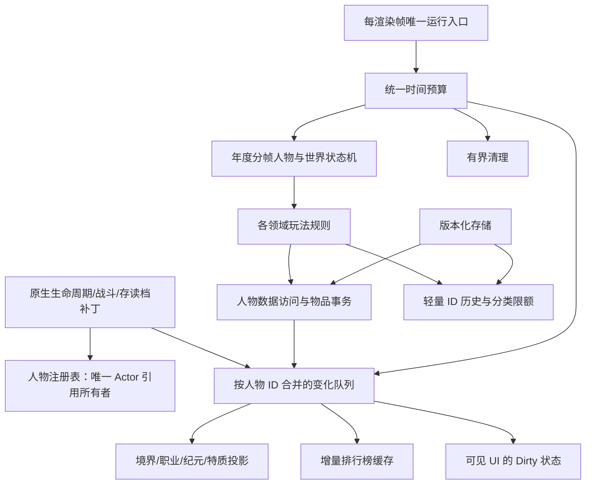

# v0.3.1 架构重构工作账本

## 基线与验收

用户已明确选择本目录当前工作树（包含既有未提交修改），允许破坏旧存档兼容。入口及 code 全部 188 个 C# 文件、51452 行已纳入 source-inventory.json；资产、配置和本地化随原项目保留。不能把编译、静态扫描或模拟基准等同于 WorldBox 中 5000 人、20 倍速的帧率实测。

## 玩法保留清单

| 领域 | 必须保留的行为 | 现有主要模块 |
|---|---|---|
| 入道与人物 | 幼年灵根、天赋、感气、凡人机缘、人工授予、寿元、称号 | ChildhoodRoot, SpiritualRoot, SensingQi, MortalFate, TraitGrant, Longevity |
| 旧法 | 入道、逐年增长、各境界突破、师徒、传承、心境、事件 | AncientLaw, AncientMentorship, CultivationGrowth, Mind |
| 新法 | 开道先锋、功法占用、仙法不可同修、转修、筑基奇物、金丹法则、元婴/化神/合道、长生/太上、逆理 | NewLawPioneer, TechniqueOccupation, NewLawBreakthrough, Taishang, InverseTruth |
| 职业 | 炼丹、制符、炼器；十八岁职业判定；熟练度/境界晋阶；配方；降阶五年额度 | ProfessionSystem, ProfessionCraftingPolicy, RecipeKnowledge |
| 物品 | 材料分级/地形探索、丹药、符箓、法宝实例/耐久/装备、卷轴、师徒馈赠、物品雨 | ItemCatalog, MaterialDiscovery, ItemUse, Artifact, MentorshipGift, ArtifactRain |
| 经济 | 乾坤袋、贡献度/灵石、天玄镜挂单/购买/售出/退回、需求与材料储备、交易历史 | BagSystem, TianxuanMarket, ConsumableInventoryPolicy |
| 世界 | 纪元轮转、旧法转新法、灾变、洞天、天地变、天地之魄、遗府/秘境、资源、地图位置与标记 | Epoch, EraCycle, Calamity, Cave, Change, WorldSoul, Resource |
| 社会 | 探索、宗门周期、功法传承、仙盟任务/兑换/势力压力、法争 | Adventure, SectLifecycle, TechniqueLineage, FactionMission/Exchange/Pressure |
| 战斗 | 境界压制、法术/法力/状态/范围效果、自动符箓、法宝加成、视觉特效 | CombatPatches, RealmSuppression, Spell, ItemUse, Artifact |
| 生死 | 死亡、原生击杀统计、凡尘瘴、转世、遗产、猫宝封存/放置 | Death, NativeKillStatistics, MortalMiasma, Reincarnation, Maobao |
| 还真 | 唯一宿主、手动/自动锚点、回载、同世界身份校验、前世档案/轮盘选择、空间灵蕴 | Huanzhen, ReincarnationProfileStore |
| 界面 | 排行榜全部排序/筛选、人物侧栏、修士列传、仙录所有页签、乾坤袋、天玄镜、入道指南、还真空间、猫宝、FPS/性能面板 | UI 目录全部入口 |
| 保存 | 世界档案、人物运行游标、物品/交易、还真外部状态、猫宝原生人物快照 | SaveVersions, ArchiveStore, Huanzhen, MaobaoArchive |

## 依赖图与新边界

## 已确认的问题与证据

- 排行榜 EntriesSnapshot 每 30 帧或年份/索引变化重新扫描修士，分配多组 List/HashSet；打开窗口还会 Invalidate，再次强制重建。展示数据与统计生产混在 UI 读取路径。
- 修士快照在境界变化时重新复制所有 ID、排序并解析所有 Actor。新法脱战施法调用该快照，表面只处理 64 人，前置快照构建仍可能处理全部人口。
- 人物侧栏 RefreshOpenForActor / RefreshActiveWindowsThrottled 通过 Resources.FindObjectsOfTypeAll 查找窗口；这是已知窗口应自行注册生命周期的场景。
- 新法功法索引含旧档分流专用状态机和候选排序；旧存档兼容与玩法规则混在年度车道。
- 世界年度已有阶段，但模块调度、人物/世界年度预算和后台刷新预算分散，累计主线程成本缺乏统一上界。
- 背包每次 Commit 序列化，并在解析时归一化/重写双份 JSON；新法经济和物品分步事务扩大该开销。
- 当前基线回归检查通过；Release 构建最初受到用户 NuGet/SDK 目录读取权限影响，需使用项目内配置与现有依赖进行构建验证。

## 当前实施与验收状态（2026-09-30）

| 工作 | 状态 |
|---|---|
| 基线全部源码、玩法和依赖清单 | 基线 188 个 C# 文件、51452 行；交付扫描逐文件保留散列和候选依赖 |
| 人物/事件/排行底层 | 当前单一注册表、ID 槽位、人物投影、合并变化队列、增量排序与人口统计已接入 |
| 调度和年度执行 | 唯一渲染帧入口、共享截止时间、分批候选与人物步骤、世界阶段、跨帧目标选择已接入 |
| UI | 可见窗口登记、Dirty/版本、排行和列传分页、乾坤袋虚拟化、原生背包分页复用、仙录预算排序和取消已接入 |
| 物品和保存 | 世界 22、背包 4、新人物命名空间和 ArchitectureV1 外部存储；事务合并、实例提取、数量守恒 |
| 长线清理 | 死亡取消人物工作及缓存；持续恢复/待挂单/地形效果均有队列容量和清理；分类历史、UI和性能缓存有生命周期 |
| 旧实现删除 | 旧人物/世界迁移、功法分流、击杀重算、旧装备迁移、猫宝摘要、无效门禁与格式化包装已删除；见完整报告 |
| 新法热点 | 用户历史采样定位资质校准平均 67.666 ms；未变化特质不唤醒，真实唤醒使用人物事件；灵根缓存和法则无分配评分已接入 |
| 自动验证 | 最终统一 Build 通过，0 警告/0 错误；回归、故障注入和数据结构长线基准通过 |
| 游戏内验收 | 待当前构建启用后的实测；不能标记整个任务完成 |

## 数据与验证边界

- 凡人收徒后备已改为城池/国家专用有序索引，旧 256 人后备遍历已移除。
- 普通成熟数量栈和未装备成熟法宝按定义/耐久合并，保留真实总量；当年和未来年份隔离。装备、赠予和出售从复制栈中提取唯一实例，不转移整栈。
- 年度完成游标为权威进度；新注册人物不补算入道以前的数百年，消费真元也不会被当成未执行而重放。
- 调度、人物清理、展示排序、药效与交易均使用当前单一实现。死亡领域异常不能阻断其他死亡后果和注册清理。
- 自动验证链接生产数据结构和规则，但原生端点替身不等同于 Unity/WorldBox 实测。千万次更新约 2.7 秒、40 字节分配，具体值见最终日志，不是 FPS 报告。
- 用户提供的数据目录中已有历史新法性能采样；当前游戏已运行，但模组入口为 mod.json.close，近期日志未找到 mod.json，尚无本次 ArchitectureV1 性能导出。
- 世界根键 mclsl.architecture.v1、人物 mclsl.architecture.v1.actor.*、外部 ArchitectureV1 仅读当前格式。旧文件不迁移、不覆盖；当前格式的主备恢复保留。
- 原生保存、还真世界回载和猫宝完整快照仍可能有同步原生边界，不承诺这些操作始终在后台预算内。

十项交付报告、实际历史采样分析、完整模块迁移、缓存限额与实机验收矩阵见 [完整重构与验收报告](完整重构与验收报告.md)。逐文件基线对照见 [source-disposition](source-disposition.md)。

尚需完成：当前构建的全部玩法/界面实机验收、4000～5000 人有效20倍速的新旧法对照、至少千年运行，并依据新报告继续修复尚存峰值。
