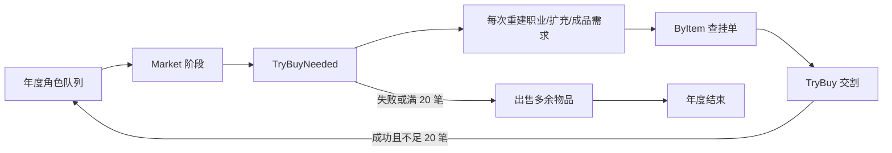
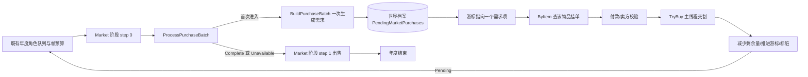
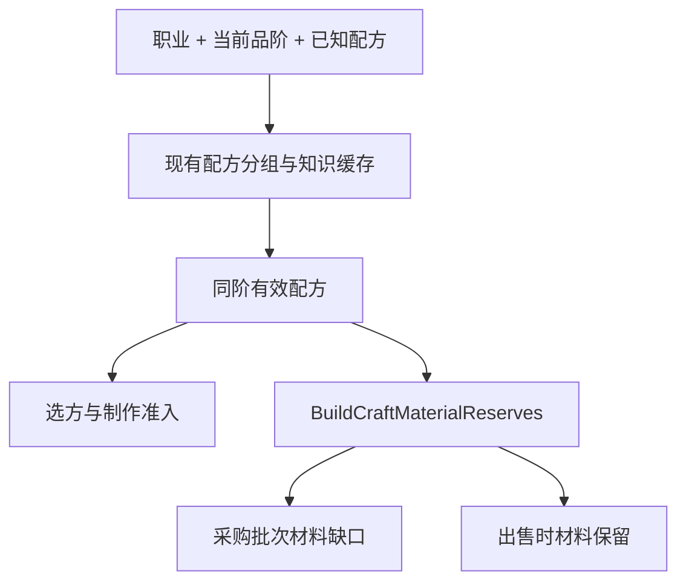

# 天玄镜与职业系统：修改前后的功能及代码架构对比

> 对比范围：本次“取消修士购买 20 笔上限、职业仅制作同阶成品、天玄镜窗口适配”更新。文中的“修改前”依据 `E:\0.3.0\rollback_backup_0.3.4` 内的市场与职业源码、更新前的策划记录；“修改后”依据当前 `inspection/0.5.1+我的模拟长生路0.3.2-并发卡死修复` 源码。旧备份未包含界面文件，界面旧行为按更新前策划记录描述。以下是**代码实现对比**，不把尚未进行的游戏内验收写成已验证结果。

## 1. 功能行为对比

### 1.1 修士自动购买

**修改前**

- `TryBuy` 和 `TryBuyNeeded` 受同一年度 20 笔上限约束；达到上限后即使仍有真实需求，也不再购买。
- 每次调用 `TryBuyNeeded` 都重新计算职业材料、扩充材料和成品需求。购买期间已购物品被消耗时，后续调用可能再次把它列为缺口。
- 职业扩充材料按“职业可用、品阶允许”普遍补一份，未必对应当前已知配方。
- 搜索候选挂单时，最优挂单交割失败可能直接错过该商品的其他卖家；单一布尔返回值同时表达“已成交”和“无后续需求”。

**修改后**

- 20 笔限制退出交易准入；旧年度购买计数字段仅作历史计数，超过 20 仍可继续递增。`MaxStackListingCount = 20` 仍限制**单笔堆叠挂单数量**，与年度购买笔数无关。
- 年度 `Market` 阶段首次执行时生成 `MclslMarketPurchaseBatch`：记录年度、职业、品阶、需求项及游标。需求项记录物品 ID、类别、剩余数量；同物品的材料和成品需求合并。此批次不因后续库存消耗或收入变化扩张。
- 材料缺口来自当前职业品阶的已知配方保留目标；成品仍按丹药、符箓、法宝、卷轴的既有需求规则生成。不再遍历所有“职业可用材料”进行泛化补货。
- 每个调度步骤处理当前一个需求项，最多成交一笔；无需求、失效需求或无可交割挂单则推进游标。返回值分为 `Pending`、`Complete`、`Unavailable`，采购结束后继续出售。
- 对同物品的候选挂单，先检查卖方存活、买方余额和卖方收款上限；已选挂单交割失败时排除它并继续寻找该物品其他挂单。贡献不足或卖方贡献接近上限时，可按现有双币种规则尝试灵石。

**行为边界**

- 批次中途出现的**新挂单**可以供尚未处理的既有需求使用，但不会生成新需求项；已处理完的项不会回头补购。
- 一个需求项缺货时本轮直接结束该项；来年重新建立需求。当前规则保留“先炼制、后采购”，买到材料不会触发同年再次制作。
- 自动购买仍属于修士年度流程，界面没有新增玩家手动下单。

### 1.2 职业制作与材料保留

**修改前**

- 配方选择可从当前品阶向下一阶回退，并用五年内降阶制作次数控制回退。
- 购买目标和出售保留量都可能包含当前职业可使用、但不属于已知有效配方的低阶或同阶材料。
- 同名材料需求虽然在配方中出现两次，但普遍材料保留规则和购买规则并非完全同源。

**修改后**

- `MclslProfessionCraftingPolicy.CanAttemptRecipe` 只接受 `recipeGrade == professionGrade`；选方只查当前品阶的 `CraftCandidates`，扣料前再次检查同阶资格。
- 当前品阶无可用配方时，沿用 `EnsureUsableRecipe` 的补方机制。缺料时不制作、不扣料、不涨熟练度；成功制作仍保持一年最多一次。
- `BuildCraftMaterialReserves` 从当前职业、当前品阶的已知可用配方计算目标。不同配方共享一种材料时按**所需最大数量**保留；同一配方两个原料位都是同种材料时目标为 2。
- 自动采购使用该目标减去库存得到缺口；出售也使用同一目标决定材料保留量。成品品阶必须同阶，但同阶配方用到低阶材料仍可采购和保留。
- 原“降阶制作年份”角色键保留供旧档兼容，当前制作流程不再读写其次数限制。

### 1.3 天玄镜窗口

**修改前**

- 窗口持续把当前宽高与屏幕宽高取较小值；屏幕缩小后再放大时，窗口不会按期望尺寸恢复。
- 市场主要采用固定侧栏与固定商品行高，长名称、卖家说明或价格容易在小窗口中裁切。
- 虽已使用首行二分查找和可见行绘制，但行高未随实际文字宽度重新测量。

**修改后**

- 市场窗口根据当前屏幕重新计算接近 `1120×740` 的期望尺寸；屏幕小于 `100×100` 时暂不绘制市场内容。关闭按钮留在窗口标题区域，窄窗口缩成“×”，Escape 仍可关闭。
- 依据**市场内容可用宽度**切换三种布局：`≥900` 三栏；`640～899` 分类与列表两栏、规则折叠；`<640` 单栏和横向滚动分类。可用高度不足时，外层页面可纵向滚动；内容有 `300` 的最小逻辑宽度并可横向滚动。
- 商品行用 `GUIStyle.CalcHeight` 按宽度测量标题、详情、价格和价格说明；窄列表把价格置于文字下方。宽度改变时重算行高与累计位置，并尽量保留原首个可见条目。
- 市场快照仍只在打开窗口时采集；缩放仅重新布局。行绘制仍由二分查找定位首行，只遍历可见行。

## 2. 代码架构对比

### 2.1 修改前的数据流

这条路径把“是否需要继续采购”隐含在 `TryBuyNeeded` 的布尔值及年度购买次数中；需求计算与交易次数耦合，且没有可存档的采购进度。

### 2.2 修改后的数据流

职责变化：

1. `MclslAnnualActorPipeline` 只编排采购、出售和年度结束；不再用 20 笔计数决定是否重入采购。`MclslScheduler` 继续负责队尾重入、每帧次数和时间预算。
2. `MclslMarketPurchaseBatch`、`MclslMarketPurchaseNeed` 保存有限需求和游标；`MclslMarketPurchasePolicy` 负责推进及基本结构校验；`MclslMarketPaymentPolicy` 统一付款资格与双币种选择。
3. `MclslTianxuanMarket` 建批、按 `ByItem` 找单并交割。交割核心先写背包、双方货币、年度购买计数和存档脏标记；装备刷新、配方学习、历史事件等后续回调分段捕获异常，避免已交割订单因回调异常被重试。
4. `MclslWorldRunState.PendingMarketPurchases` 只保存未完成批次，随原有世界档案序列化；完成、角色失效或退出年度队列时删除。旧档缺字段时初始化空集合，再按当下状态建立批次。世界档案顶层版本仍为 `22`。

### 2.3 职业规则的依赖关系

原来的“可回退一阶”分支和“通用职业材料各留一份”分支被移出当前路径。已知配方缓存仍按知识原文、职业分类和品阶失效；材料目标本身目前**未另建持久缓存**，每次计算使用已缓存的可用配方数组。这一点与策划案所述的“仅变化时更新静态目标”有实现差异，后续是否需要缓存应以运行测量决定。

### 2.4 界面渲染路径

市场窗口布局与商品展示行仍位于 `MclslFeatureWindow`，没有引入新 UI 框架或对乾坤袋、指南的共同窗口路径做整体改写。调整市场尺寸不会重建市场快照，也不会每帧重新测量全部行。

## 3. 状态、性能与兼容性

- **状态生命周期**：每名角色、每个年度最多有一个未完成采购批次；它只属于当前世界档案。存档恢复依赖原有年度角色状态继续进入 `Market` 阶段，使用批次游标继续执行。职业或品阶在批次中途变化时，旧材料需求会在处理时失效；新职业需求等下一年度建批。
- **计算规模**：建批一次需要遍历当前已知配方目标和成品需求；后续每步只处理一个需求项。单个需求项会扫描对应 `ByItem[itemId]` 挂单列表；候选交割失败时会排除失败单并重扫，极端情况下单步成本可能高于一次线性扫描，不能仅以“每帧有预算”证明无卡顿。
- **存档校验**：读档时清理无效角色 ID 或年度批次；进入交易时还会校验批次数量、游标以及当前项的物品 ID、类别与数量。该校验并非对所有历史项逐条做强验证，损坏记录的运行时影响仍需用异常存档用例覆盖。
- **兼容性**：旧购买计数字段和旧降阶年份字段保留，但不再决定新购买或制作资格；世界档案版本号不提升。旧档没有采购集合时会自然生成当年待处理批次。
- **观测指标**：性能探针已记录“需求清单生成”“挂单查找交割”“可见行绘制”耗时、已检查挂单数与未完成批次数。应在相同世界、人口、速度、挂单规模下比较修改前后数据。

## 4. 已验证内容与待验收内容

**已验证（代码层）**

- Release 构建通过，0 warning、0 error。
- `ProfessionGradePolicy` 测试通过：职业 0～4 品阶同阶准入、年度购买计数超过 20、28 项需求的序列化恢复、同名材料需求 2 份、卖方贡献容量不足时改用灵石。
- 中文本地化 JSON 可解析。

**仍需在游戏中验收**

- 超过 20 笔真实成交及高人口、高挂单下的单步耗时与年度积压。
- 采购中途存档/重载、角色死亡、世界切换和还真回载的端到端结果。
- 320×240、640×360、800×600、1280×720、1920×1080 与更小可用尺寸下的长文字、滚动、展开卖家和窗口反复缩放；同时回归乾坤袋和指南。
- 法宝实例、卷轴学习和异常回调后的实际游戏状态。上述场景尚不能仅凭单元测试或构建成功确认。

## 5. 关键源码索引

- 采购批次与付款规则：[MclslMarketPurchaseBatch.cs](../code/MySimulatedLongevityRoad/Data/MclslMarketPurchaseBatch.cs)
- 市场需求、挂单查找与交割：[MclslTianxuanMarket.cs](../code/MySimulatedLongevityRoad/Systems/Crafting/MclslTianxuanMarket.cs)
- 年度市场阶段：[MclslAnnualActorPipeline.cs](../code/MySimulatedLongevityRoad/Systems/Runtime/MclslAnnualActorPipeline.cs)；年度预算与队列：[MclslScheduler.cs](../code/MySimulatedLongevityRoad/Systems/Runtime/MclslScheduler.cs)
- 同阶制作：[MclslProfessionCraftingPolicy.cs](../code/MySimulatedLongevityRoad/Systems/Crafting/MclslProfessionCraftingPolicy.cs)；材料目标：[MclslItemEconomy.cs](../code/MySimulatedLongevityRoad/Systems/Crafting/MclslItemEconomy.cs)；配方缓存：[MclslMentorshipGiftSystem.cs](../code/MySimulatedLongevityRoad/Systems/Crafting/MclslMentorshipGiftSystem.cs)
- 世界档案状态：[MclslArchiveData.cs](../code/MySimulatedLongevityRoad/Data/MclslArchiveData.cs)；窗口布局和虚拟列表：[MclslFeatureWindow.cs](../code/MySimulatedLongevityRoad/UI/MclslFeatureWindow.cs)
- 代码层测试：[ProfessionGradePolicy/Program.cs](../tests/ProfessionGradePolicy/Program.cs)
